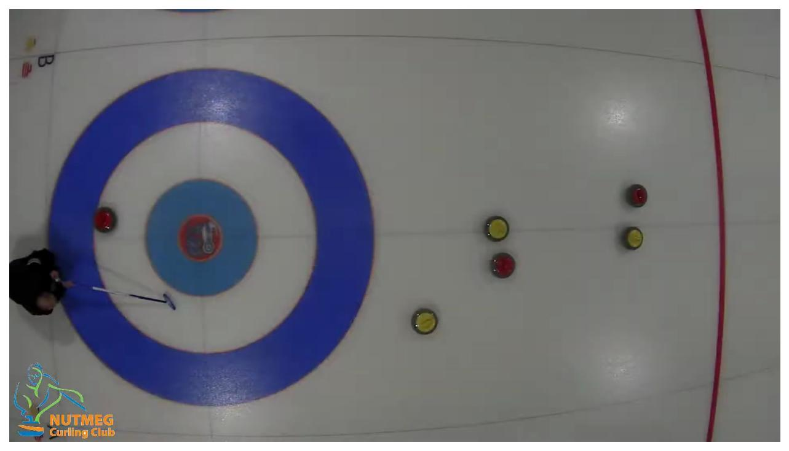
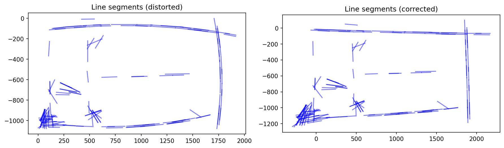
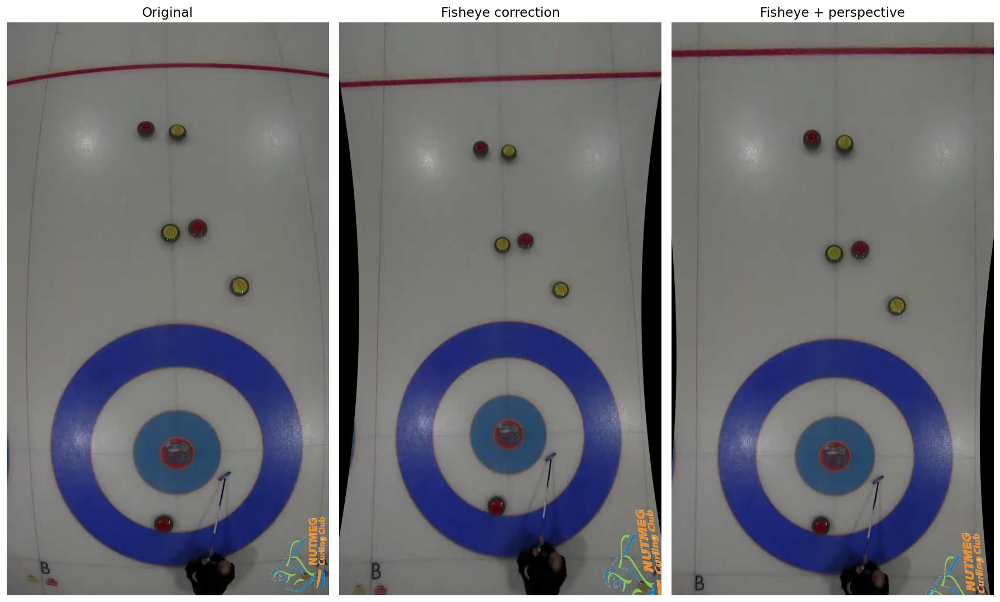
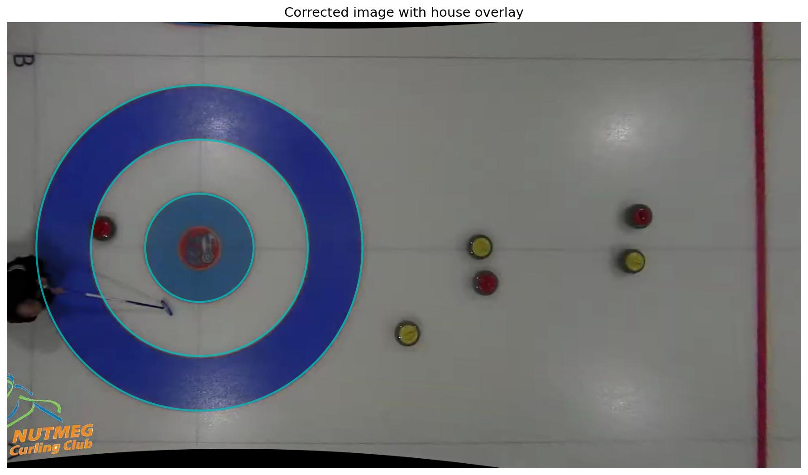
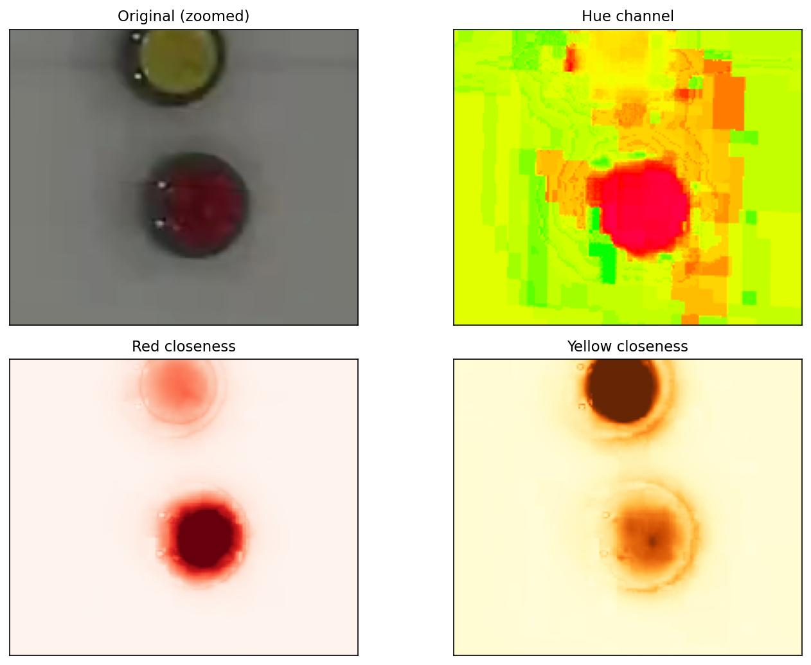
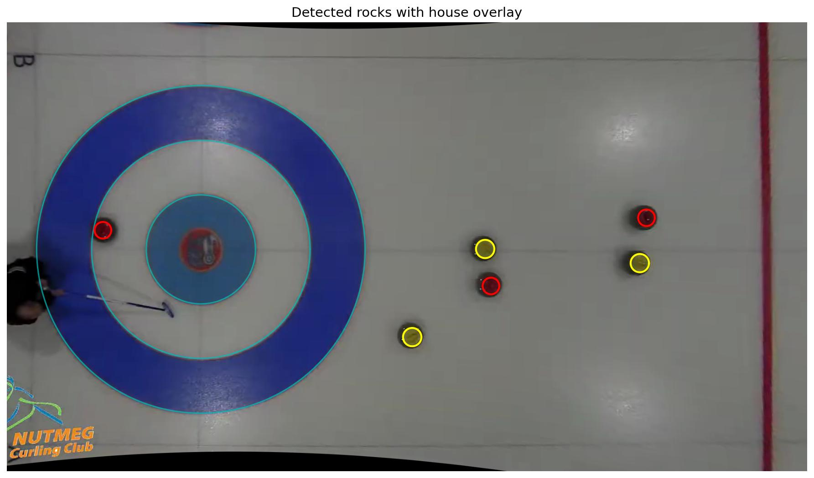
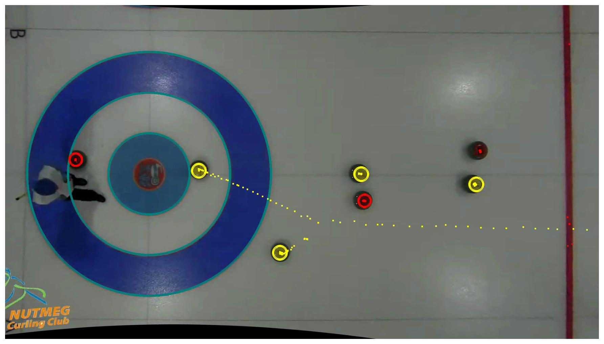

+++
date = '2026-03-25T00:00:00-05:00'
draft = false
title = 'Tracking Curling Rocks from Overhead Video, Part 1'
slug = 'curling-rock-tracking-part1'
math = true
+++

If you've ever watched a curling game on TV, you've probably noticed those nice overhead shots of the house, sometimes with graphics overlaid showing the positions and trajectories of the rocks. Commentators use [telestrators](https://en.wikipedia.org/wiki/Telestrator) to draw lines and place stones on screen while explaining shots. More recently, automated systems can track stones in real time -- [CurlingHunter](https://pmc.ncbi.nlm.nih.gov/articles/PMC9639444/) used computer vision at the 2022 Beijing Olympics, while [SPECTO Curling](https://www.angularvelocity.fi/specto-curling) uses LIDAR to measure stone speed and position. I thought it would be fun to try building something like that myself, starting from a simple overhead camera at my local curling club.

<!--more-->

I had time during the last off-season to play around with a few ideas using the footage we had from our old broadcast system. The source footage is a single overhead camera mounted above sheet B at [Nutmeg Curling Club](https://nutmegcurling.com) during the Club Challenge in 2021. The camera is a wide-angle (fisheye) type, which gives a nice wide field of view but introduces significant barrel distortion. Before we can do anything useful with the video, we need to undo that distortion.

# the fisheye problem

Here's what a raw frame from the overhead camera looks like:

Notice how the straight lines of the curling sheet -- the sidelines, the hog lines, the tee line -- all appear curved. This is classic [radial distortion](https://docs.opencv.org/4.x/dc/dbb/tutorial_py_calibration.html) from a fisheye lens. The standard model for this kind of distortion relates the distorted radius \(r_d\) to the undistorted radius \(r_u\) by a polynomial:

$$ r_d = r_u (1 + k_1 r_u^2 + k_2 r_u^4) $$

where \(k_1\) and \(k_2\) are the radial distortion coefficients. The challenge is finding the right values of \(k_1\) and \(k_2\) for our particular camera.

# finding the distortion parameters

I don't have a calibration grid, and I wasn't about to tape one to the ice. Instead, I relied on the fact that curling sheets are full of straight lines -- the sheet boundaries, the hog lines, and the center line should all be perfectly straight in an undistorted image.

The approach is simple: run [edge detection (Canny)](https://docs.opencv.org/4.x/da/d22/tutorial_py_canny.html) on the raw frame, extract line segments using the [probabilistic Hough transform](https://docs.opencv.org/4.x/d6/d10/tutorial_py_houghlines.html), then search for distortion parameters that make these line segments as straight as possible. Here's what the detected line segments look like before and after applying the correction:

On the left, the line segments extracted from the distorted image trace out visible curves, especially near the edges. On the right, after applying the correction with \(k_1 = -0.58\) and \(k_2 = 0.28\), the segments are much straighter. The curling sheet boundaries that were bowed outward are now close to straight.

But radial distortion isn't the only issue. The camera isn't mounted perfectly perpendicular to the ice -- there's a slight tilt and rotation. To correct for that, I chain together a few additional transformations: a small rotation (1.5 degrees of roll), a perspective correction, and a translation offset. The full pipeline looks like:

$$ M = M_\text{center}^{-1} \cdot M_\text{offset} \cdot M_\text{roll} \cdot M_\text{pitch} \cdot M_\text{center} $$

Here's the progression from the raw image through each correction stage:

The fully corrected image on the right has straight sidelines and a properly circular house. To verify the geometry, I overlay the three house circles (12-foot, 8-foot, and 4-foot) at their known positions:

The circles line up nicely with the painted rings on the ice. We're in business.

The nice thing about this approach is that the distortion map only needs to be computed once, and then we can apply it to every frame using OpenCV's `remap()`. The default implementation runs on CPU, so it's not quite fast enough for real-time use, but it works fine for offline processing.



# finding the rocks

With the geometry sorted out, the next step is detecting the curling rocks in each frame. Curling rock handles come in two colors -- red and yellow (or sometimes blue and yellow, depending on the club). At Nutmeg, it's red and yellow.

Rather than training a neural network for this (that's for a future post), I went with a classical computer vision approach: color-based detection followed by the Hough circle transform. The idea is to create a "closeness" map for each color, highlighting pixels that look like they belong to a rock of that color.

The closeness metric works in HSV color space. For each pixel, I compute:
- How close the hue is to the target color (with wrap-around handling for the hue wheel)
- How close the saturation is
- How close the brightness (value) is

These are combined with Gaussian smoothing and exponential weighting to produce a smooth response map. Here's what it looks like zoomed in on a couple of rocks:

The top-left panel shows the original image zoomed in on a yellow and a red rock. The top-right shows the hue channel in HSV space. The bottom panels show the closeness maps for red and yellow respectively -- the rocks light up clearly against the white ice.

From these closeness maps, I run Canny edge detection and then the [Hough circle transform](https://docs.opencv.org/4.x/da/d53/tutorial_py_houghcircles.html) to find circular objects of the expected radius (~20 pixels for red, ~22 for yellow -- the slight difference is due to the reddish hue of the granite blending into the red edge, shifting the detected boundary inward). A final validation step checks the color at the center of each detected circle to reject spurious matches.

All six rocks on the sheet are correctly identified. The cyan circles show the house overlay for reference.

# putting it all together

The final step is running this detection pipeline frame by frame across the video and accumulating trajectory trails. For each frame, we:

1. Apply the precomputed fisheye + perspective correction
2. Overlay the house circles
3. Detect red and yellow rocks
4. Draw circles around each detected rock
5. Plot a dot at each rock's center position, keeping all previous dots visible

The accumulated dots trace out the paths the rocks traveled during the end. Here's what the final frame looks like with all the trajectory trails:

You can see the yellow rock's trajectory as it ticks a guard and rolls to the top four foot behind cover. And here's the full annotated video:



# what I learned

This was a fun first pass at the problem. The classical CV approach -- hand-tuned Canny filter parameters, color matching plus Hough circles -- works reasonably well for a controlled environment with a static overhead camera and a white ice surface. A few takeaways:

1. **Fisheye correction is essential.** Without it, the house isn't circular, distances are distorted, and nothing lines up. Getting the distortion parameters right makes everything downstream much easier.

2. **HSV color space is your friend.** Working with hue rather than raw RGB makes the color detection robust to varying brightness across the sheet (the ice is brighter near the center under the lights).

3. **Validation matters.** The Hough circle transform is prone to false positives. Checking the center pixel color against the target is a cheap and effective way to prune bad detections.

There's a lot of room for improvement. For starters, the detection isn't quite as robust as I'd like. You can see that even in my hand-picked "nicer" video above. The hog line is being recognized as a red rock in a number of places. The color thresholds are hand-tuned and would break on a different sheet with different lighting. The trajectory is just dots with no temporal association -- we don't know *which* rock moved. And we're processing a clip at a time rather than doing real-time tracking. These are all things I'm planning to tackle in future posts. Stay tuned!
