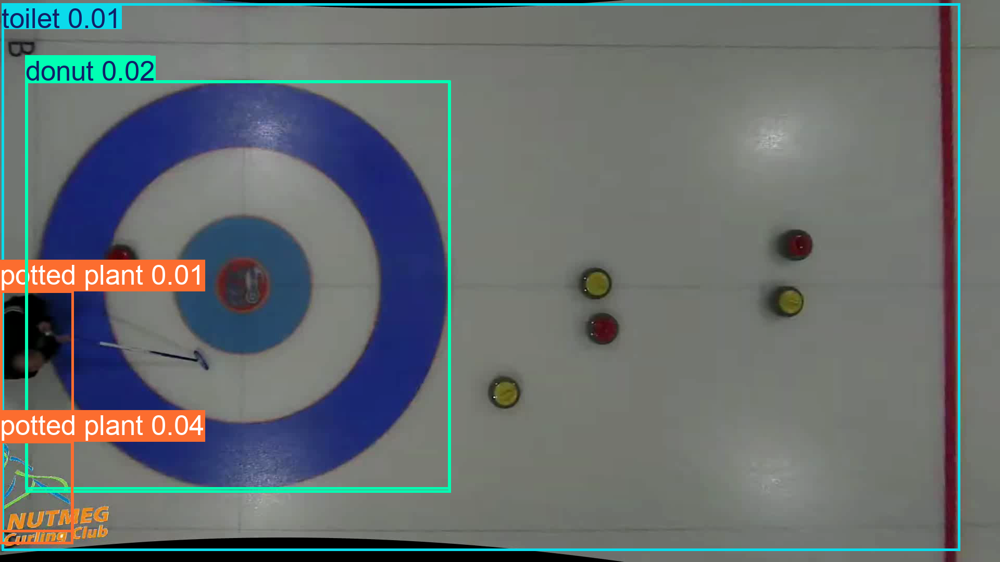
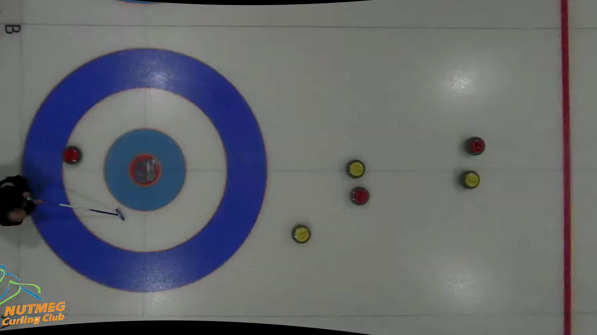
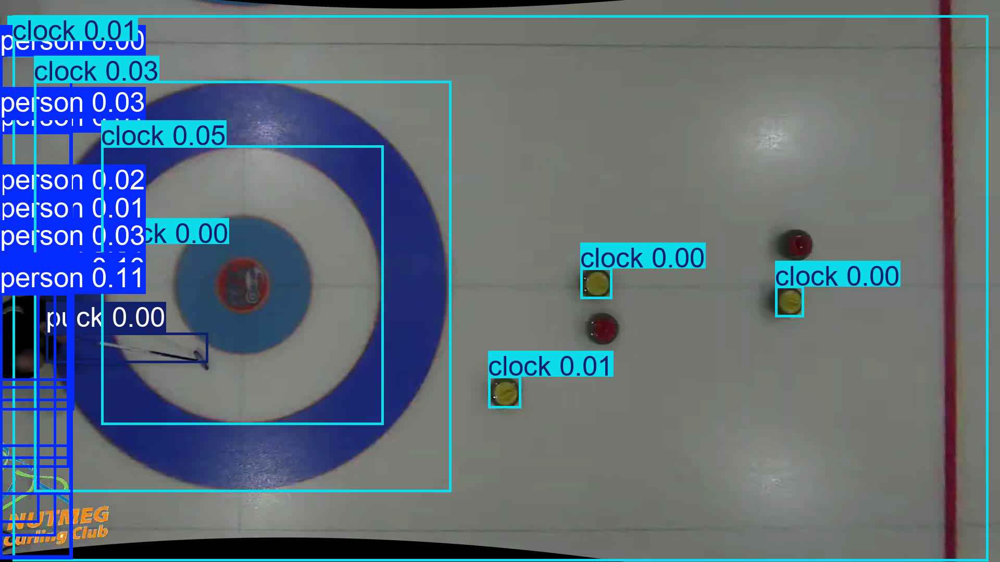
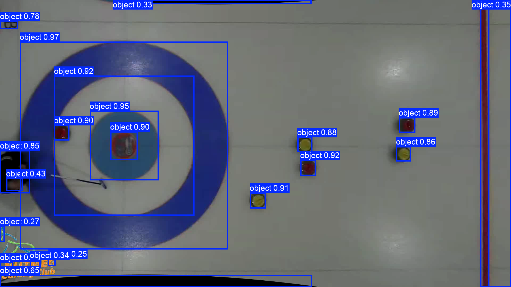
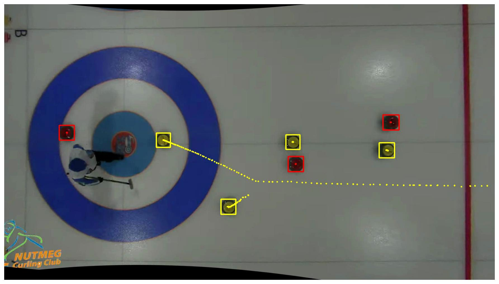

+++
date = '2026-04-04T06:00:00-05:00'
draft = true
title = 'Tracking Curling Rocks, Part 2: Off-the-Shelf Deep Learning'
slug = 'curling-rock-tracking-part2'
+++

In [part 1](/posts/curling-rock-tracking-part1/), I built a rock detection pipeline using classical computer vision -- fisheye correction, HSV color matching, and the Hough circle transform. It worked reasonably well, but was held together by hand-tuned thresholds that would fall apart the moment the lighting changed or someone switched to a different camera. The hog line kept getting detected as a red rock. I wanted to see if off-the-shelf deep learning models could do better, without having to train anything myself.

<!--more-->

The idea was simple: take a pre-trained model, point it at the corrected overhead video frames from part 1, and see what happens. I tried three different approaches, each with a different philosophy.

# the domain gap problem

The most obvious thing to try is a standard object detection model. [YOLOv11](https://docs.ultralytics.com/models/yolo11/) trained on [COCO](https://cocodataset.org/) can detect 80 categories of everyday objects in real time. Let's see what it makes of a curling sheet viewed from above:

A toilet. A donut. Two potted plants.

Not a single curling rock detected. This is a trivial form of the [domain gap](https://machinelearning.apple.com/research/bridging-the-domain-gap-for-neural-models) problem. The model has never seen a curling rock from overhead, so it does its best to map what it sees onto the 80 COCO categories it knows. The house vaguely resembles a donut or a toilet, and the curler with their broom becomes a potted plant.

The confidence scores are telling -- all below 0.05. The model knows it's guessing.

# zero-shot detection with text prompts

What if we could tell the model what to look for? [YOLO-World](https://docs.ultralytics.com/models/yolo-world/) supports open-vocabulary detection -- you define custom classes via text, and the model uses language-vision embeddings to match them. The natural first attempt is to just ask for what we want: `["curling rock"]`.

Nothing. Zero detections, even with the confidence threshold dropped to 0.001. Same result for `"curling stone"`, `"stone"`, and `"disc"`. The model's language-vision embeddings simply have no representation for what a curling rock looks like from above.

Backing off to less specific terms helps a little. `"rock"` gets 2 detections at vanishingly low confidence (0.002). `"puck"` finds one (0.005). But the detections are essentially noise. I ended up trying a grab-bag of vaguely related shapes -- `["person", "clock", "ball", "magnet", "puck"]`:

Now the model finds 21 things: "12 persons, 8 clocks, 1 puck." The yellow rocks are being detected as "clocks" (round things with markings), and it did find one "puck" which is in fact a broom. Maybe it's associating the broom with a hockey stick, which then relates to a puck? It's also having trouble locating the one person all over the left side of the frame, and the best confidence score is only 0.11.

The pattern across all these attempts is clear. The model has no idea what a curling rock looks like from above -- asking for one by name gives you nothing, and asking for vaguely related shapes gives you hallucinations. The language-vision alignment in YOLO-World is only as good as the overlap between your scene and what the model saw during training. An overhead view of colored discs on white ice is simply too far from anything in that distribution.

# segment everything, ask questions later

Time to try a different philosophy. Instead of asking "where are the curling rocks?", what if we ask "where are all the objects?" and filter afterward?

[FastSAM](https://docs.ultralytics.com/models/fast-sam/) is a fast variant of the Segment Anything Model that can find all distinct objects in an image without knowing what they are. It ran in about 370ms per frame on my M1 Macbook -- much more practical than SAM 2.1, which took 78 seconds per frame on CPU.

Now we're getting somewhere. FastSAM finds 21 objects, and all six curling rocks are among them. It also picks up the house rings, the Nutmeg logo, the hog line, and some markings on the ice, but that's fine -- we can filter those out.

The key insight is that this approach separates *detection* from *classification*. This works because of a fundamental architectural difference. YOLO-style detection heads are trained to output class probabilities -- every detection must be assigned a category, so if the model has no concept of "curling rock," it simply can't find one. FastSAM sidesteps this entirely. It's built on YOLOv8-seg but trained on single-class instance masks, so its loss function rewards finding *any* object-like region regardless of what it is. It doesn't need to know what a curling rock is -- it just needs to notice that something is there.

FastSAM handles the hard part (finding object-like regions) and we handle the easy part (deciding which ones are rocks). For classification, I fell back on the same color heuristics from part 1:

1. **Size filter**: keep only bounding boxes between 48-81 pixels wide and 48-63 pixels tall. Rocks from this camera height fall in a narrow size range.
2. **Color filter**: for each candidate, compute the HSV hue and saturation closeness to our red and yellow reference vectors. If enough pixels match (400+ pixels within threshold), it's a rock.
3. **De-duplication**: FastSAM sometimes produces overlapping detections for the same rock. If two boxes are within 24 pixels of each other, keep the larger one.

Running this pipeline on the full video with trajectory tracking gives us:

Bounding boxes instead of circles, but the same trajectory accumulation as part 1. And here's the full video:



# what I learned

This exercise was a good reality check on the state of "just use a pre-trained model" for custom applications.

1. **Domain gap is real.** Standard COCO models are useless for overhead curling footage. The visual domain is too far from anything in the training set.

2. **Zero-shot text prompts are promising but limited.** YOLO-World can't find a "curling rock" even when you ask for one by name. The text-vision alignment breaks down completely for unusual viewpoints and niche objects.

3. **"Segment everything + heuristics" is a viable middle ground.** FastSAM doesn't need to know what a curling rock is -- it just needs to find blob-like regions. Combined with simple size and color filters, this gives us a workable detector without any custom training.

4. **But it's still a crutch.** We're still leaning on hand-tuned color thresholds and size ranges. Move to a different club with different lighting or a different camera height, and all those magic numbers break. The real solution is to train a custom object detector on labeled curling footage. That's next.
