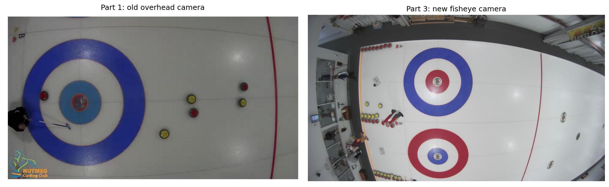
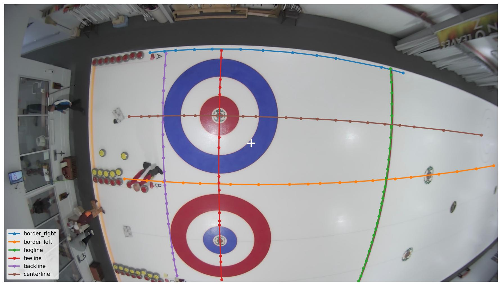
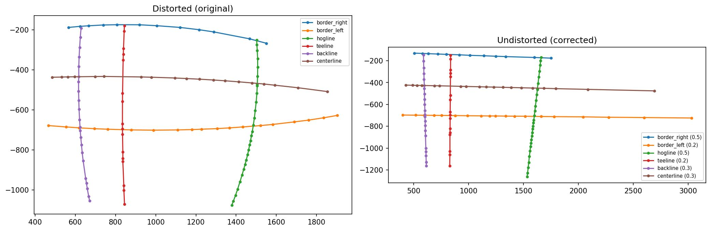
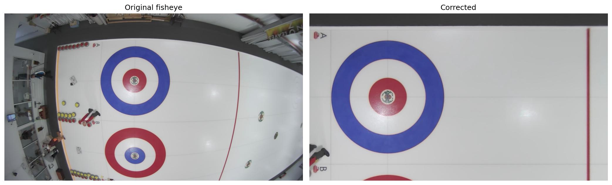
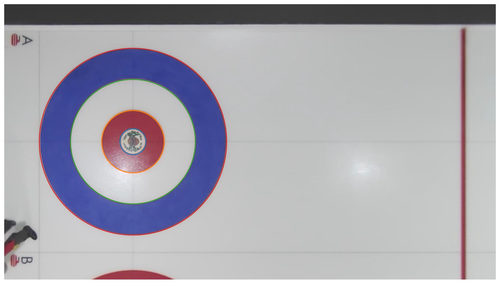

+++
date = '2026-04-17T08:00:00-05:00'
draft = true
title = 'Tracking Curling Rocks, Part 3: New Camera System'
slug = 'curling-rock-tracking-part3'
math = true
+++

While I was conducting my experiments in parts [1](/posts/curling-rock-tracking-part1/) and [2](/posts/curling-rock-tracking-part2/), the club planned for and got a new streaming system installed by [Curling Stadium](https://curlingstadium.com/) in the summer of 2025. Their standard setup puts 4 HD 1080p cameras on each sheet: two PTZ (pan-tilt-zoom) cameras mounted on the end walls for broadcast-style coverage, and two POV (point-of-view) overhead cameras mounted directly above each house. For my purposes, the overhead cameras are the interesting part -- they give a fisheye view of the house end from directly above, which is exactly what I need for rock tracking. With six overhead cameras across three sheets, it was time to recalibrate everything.

<!--more-->

This was also a chance to do the calibration properly. In part 1, I eyeballed the distortion parameters by tweaking `k1` and `k2` until the lines looked straight. It worked, but it was hacky. With six cameras to calibrate, I needed something more systematic.

# the equidistant projection model

The old polynomial distortion model from part 1 related distorted and undistorted radii by:

$$ r_d = r_u (1 + k_1 r_u^2 + k_2 r_u^4) $$

You might think it would be straightforward to just apply the same formula to the new camera, save for a new set of parameters, and you would be wrong. Unfortunately, the new overhead cameras ([AIDA HD-NDI-200](https://aidaimaging.com/hd-ndi-200/)) cover a much wider field of view than the old one, and that turns out to cause some trouble:

The old camera covered roughly one house on one sheet. The new fisheye cameras see two houses across two adjacent sheets -- but the distortion is so severe near the edges that the polynomial model simply breaks down. A low-order polynomial can't capture the rapid increase in distortion at large angles. The new cameras use a standard [fisheye lens](https://en.wikipedia.org/wiki/Fisheye_lens#Mapping_function), which is much better described by the [equidistant projection](https://docs.opencv.org/4.x/db/d58/group__calib3d__fisheye.html) model:

$$ r_d = f \cdot \theta $$

where \(\theta\) is the angle from the optical axis and \(f\) is a scaling factor. In a pinhole camera, the same point would land at \(r_u = f \cdot \tan(\theta)\). Substituting \(\theta = r_d / f\) gives the undistortion mapping:

$$ r_u = f \cdot \tan(r_d / f) = r_d \cdot \frac{\tan(r_d / f)}{r_d / f} $$

So each pixel gets scaled by the factor \(\tan(r_d/f) / (r_d/f)\), which is always \(\geq 1\) and grows rapidly near the edges -- exactly compensating for the fisheye compression.

OpenCV's [fisheye module](https://docs.opencv.org/4.x/db/d58/group__calib3d__fisheye.html) actually adds a polynomial correction on top of the equidistant model: \(\theta_d = \theta(1 + k_1\theta^2 + k_2\theta^4 + k_3\theta^6 + k_4\theta^8)\). But our cameras fit well with just the zeroth-order term (\(k_1 = k_2 = k_3 = k_4 = 0\)), so the model reduces to a single parameter \(f\) plus center offsets \(c_x, c_y\) -- three parameters total compared to five in part 1's polynomial model. Fewer parameters, better physical grounding, and as it turns out, lower calibration error.

# calibrating without a checkerboard

Same idea as part 1: curling sheets are full of straight lines that we can use as calibration targets. But instead of eyeballing, I wrote a small interactive tool (`manual_calibration.py`) that lets you click on the visible lines in a video frame -- the sheet borders, hog line, tee line, back line, and center line.

Each colored line represents a set of clicked points along a known straight feature on the ice. These should all be perfectly straight in the real world, so any curvature is due to the lens distortion.

With these points in hand, the calibration becomes an optimization problem: find the values of \(f\), \(c_x\), and \(c_y\) that minimize the total "non-straightness" of the undistorted lines. The straightness metric is elegant -- for each set of points, compute the covariance matrix, eigendecompose it, and the smaller eigenvalue gives you the RMS distance of the points from their best-fit line.

Running BFGS optimization on this loss gives us \(f = 0.735\), implying a half-angle field of view of about 78 degrees. The optical center is slightly offset from the image center (933, 544 vs 960, 540 on a 1920x1080 frame), which is not great, but also not too concerning -- the lens mounting just isn't perfectly centered.

Here's how the calibration points look before and after undistortion:

On the left, the border lines (blue and orange) are visibly curved. On the right, after applying the equidistant model correction, all six lines are straight. The per-line residuals (shown in the legend) are all well under a pixel.

# perspective correction from known geometry

Undistorting the fisheye is only half the job. The camera isn't mounted directly above the center of the sheet -- it's off to one side and slightly tilted. We need a perspective transform to get a proper top-down view.

Curling sheet dimensions are [standardized by the WCF](https://worldcurling.org/rules/): the hog line to back line distance is 27 feet, with the tee line at 6 ft from the back line, etc. Since we know where the sheet borders, hog line, and back line are (from our calibration points), we can compute the four corner intersections in the undistorted image and map them to their known physical positions using a [homography](https://docs.opencv.org/4.x/d9/dab/tutorial_homography.html).

The nice thing is that both the fisheye correction and the perspective transform can be composed into a single remap operation. We precompute the combined pixel mapping once, then apply it to every frame with `cv2.remap()` -- minimal per-frame overhead.

And here's the corrected image with house circles overlaid at the button (10"), 4-foot, 8-foot, and 12-foot rings:

The circles line up with the painted rings on the ice, confirming the calibration is accurate.

# applying calibration to all cameras

The same procedure applies to all six cameras. I packaged the transforms into composable classes, so after manually labeling the straight lines, calibrating a new camera is just a matter of loading the labeled calibration points and running the optimizer.

Once calibration is done, I tested out the performance of the OpenCV remap function. The combined transform runs at about 123 fps on my laptop for 1280x720 output -- fast enough for batch processing, and potentially real-time with GPU acceleration.

Here's a short clip from one of the corrected demo videos:



# full-sheet view

A bonus of the wide fisheye field of view: each camera sees well past the hog line into the mid-sheet area, so the home and away views do overlap. By stacking the two corrected views -- away end on top, home end on bottom -- we get a complete top-down view of the entire sheet in a single frame:



Every rock, every player, and every line from back line to back line, synthesized from two cameras mounted 21 feet above the ice.

# what changed from part 1

| | Part 1 (old camera) | Part 3 (new cameras) |
|---|---|---|
| **Distortion model** | Polynomial (\(k_1, k_2\)) | Equidistant (\(f\)) |
| **Parameters** | 5 (hand-tuned) | 3 (optimized) |
| **Calibration** | Eyeballed | Systematic (clicked points + BFGS) |
| **Perspective** | Manual matrix tweaking | Homography from known sheet dimensions |
| **Output** | Single sheet, house end only | Full sheet, both ends, all sheets |

The equidistant model with only 3 optimized parameters achieves sub-pixel line residuals across all six cameras -- a level of accuracy that would have been difficult to reach by hand-tuning 5 parameters per camera.

With the new camera system calibrated, we're ready to go back to the detection problem -- this time with better data and the goal of training a custom model. That's coming up next.
