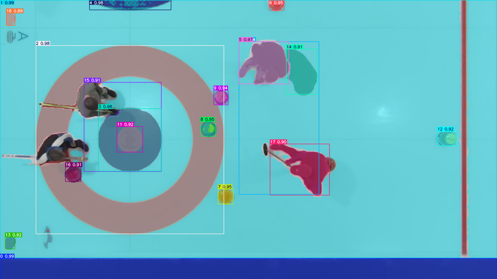
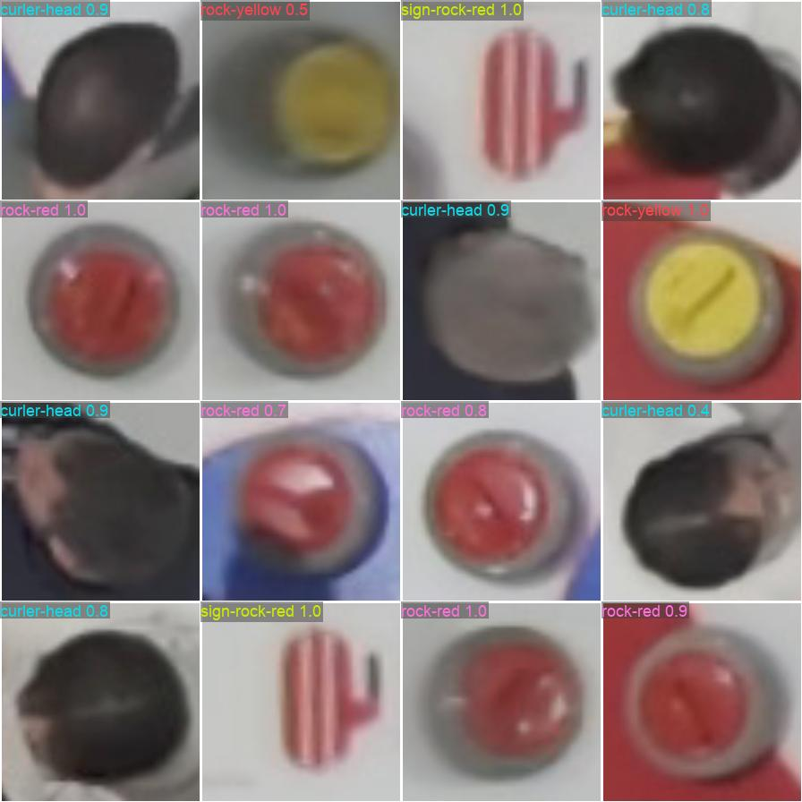

+++
date = '2026-05-11T08:00:00-05:00'
draft = false
title = 'Tracking Curling Rocks, Part 4: Bootstrapping a Detection Model'
slug = 'curling-rock-tracking-part4'
math = true
+++

Having laid the ground work in camera calibration ([part 3]()) and with our initial exploration done using artificial neural networks models to do rock detection ([part 2]()), we are now in a good position to train our custom models. The hope is that this will deliver better accuracy while improving efficiency i.e. faster detection.

We need to label some images to train models. But since I don't have a team of professional data labellers at my disposal, I would need to make this process as easy as possible.

<!--more-->

# semi-auto-annotation with SAM

Recall that in [part 2]() we used a hybrid approach where the [FastSAM](https://docs.ultralytics.com/models/fast-sam/) model was used to find candidate objects, and then heuristics we developed in [part 1]() were used to filter for red and yellow rocks. Since we are willing to train neural network models now, we could simply:
1. Use SAM/FastSAM to pick out the same candidate objects.
2. Use some of the same heuristics to assign labels to them, i.e. auto-annotation.
3. Review by human and correct if necessary.

The beauty of including auto-annotation in our data processing/annotation pipeline is that we don't need to complete all annotations at once! If we have 1000 images in the training set, we could first annotate 100 images, use those to train the model, then use the model to help annotate the next 200 images, then use them to train the model to reach higher precision, and repeat until all images are annotated.

Our end goal is to create a detection model: a model that for an input image, will output a list of objects with their classes (red rock, yellow rock, etc.) and their coordinates. But we don't have to do that from the outset. To make the data annotation process faster, we could make a classifier model first. This is a model that given an input image of a single dominant object, will output the class of the object. This is typically a smaller model which trains faster and runs faster, perfect for our iterative auto-annotation workflow.

So, what does a SAM model's output look like? We've seen a bit from part 2. It'll give us a set of masks for the objects it found in the image.



As shown in the annotated image above, the SAM model correctly identifies all the rocks in the frame, plus a few other things: logos under the ice, curlers, house rings, etc. All we have to do is to crop them and feed them to the human annotator (i.e. myself) to assign image classes to them.

At this point, I should mention that I've relied heavily on the various image detection model implementations by [Ultralytics](https://www.ultralytics.com/). For this demo project, we'll be using their implementation under the AGPL-3.0 license.

For image labeling / annotation, I decided to use [Label Studio](https://labelstud.io/). It has some limitations that we will be discussing in a future post. Because of these limitations, we'll eventually move to a custom labeling solution. But I won't bore you with the details today.

Because a classifier model is relatively cheap to train and run, even though this task is simple, I opted to use the "medium" sized YOLO classifier model. With Ultralytics, the training is as simple as running the following:

```python
#!/usr/bin/env python
from ultralytics import YOLO

model = YOLO("yolo11m-cls.pt")

results = model.train(data=".", epochs=100, batch=-1, patience=50, imgsz=224,
        erasing=0.0)
```

I did a few rounds of the labeling-training-autoanno loop to reach the following classes and image count in the training and validation sets:

| datset type | rock-yellow | rock-red | rock-occluded-yellow | rock-occluded-red | others |
|-------------|-------------|----------|----------------------|-------------------|-------|
| train       | 58          | 50       | 5                    | 4                 | 133   |
| validation  | 14          | 12       | 1                    | 1                 | 33    |

Why did I split each rock color into the occluded and non-occluded classes? Because our goal is not just to identify the rocks, but also to get the coordinates of the rocks to as high precision as possible. We know for a fact that we are not going to get as good an estimate if the rock is partially occluded by e.g. a curler, so it will probably help if we can identify and reject them when tracking rocks. 

The following image shows the trained model's prediction on a sample of the validation dataset. The model achieves about 90% accuracy on the validation set. Not worth writing home about, but good enough for our next step! We know we are not saturating the model's full capabilities at this network size. It's mostly constrained by the training data size and quality.



# training a YOLOv11 detection model

Now equipped with the classifier model, we can finally start the process of annotating data and training our rock detection model. I took about 1 hour of curling footage and got to work.

I sampled the video at 1 second (30 frames) interval to keep the dataset size manageable. In the similar vein, I edited out all the non-interesting parts, where there weren't any rocks in the frame. I used SAM and the classifier we just trained to pre-annotate the dataset, then manually verified in Label Studio, then trained a YOLOv11 model on this dataset. I ended up with a training set with 357 images, and a validation set of size 100.

I trained the YOLOv11m model for 200 epochs. Benchmarking the model on my M1 Macbook Air gives the following:
```
Ultralytics 8.3.232 🚀 Python-3.12.10 torch-2.5.1 MPS (Apple M1)
YOLO11m summary (fused): 125 layers, 20,033,116 parameters, 0 gradients

                 Class     Images  Instances      Box(P          R      mAP50  mAP50-95)
                   all        100        334      0.961      0.931      0.964      0.921
              rock-red         48        129       0.99      0.984      0.991      0.941
           rock-yellow         42        126      0.986          1      0.994      0.962
     rock-occluded-red         46         51       0.91      0.902      0.963      0.926
  rock-occluded-yellow         26         28      0.959      0.839       0.91      0.855
Speed: 1.7ms preprocess, 53.2ms inference, 0.0ms loss, 47.7ms postprocess per image
```

A good resource for understanding the metrics P=precision, R=recall, mAP50, and mAP50-95 is [here](https://docs.ultralytics.com/guides/yolo-performance-metrics/#object-detection-metrics). I won't get into too much details here. As a rule of thumb, mAP50-95 > 0.9 is considered very good.

For good measure, I trained a YOLOv11n model using the same dataset but for 500 epochs. There's practically no difference in its performance compared to the medium-sized model, despite the model being 8 times smaller, and running 4 times faster! We are still firmly in the data-constrained regime. It is notable that here now we can process 1 frame in just under 33 milliseconds even on my little laptop, meaning we are crossing over to the real-time processing territory!
```
Ultralytics 8.3.232 🚀 Python-3.12.10 torch-2.5.1 MPS (Apple M1)
YOLO11n summary (fused): 100 layers, 2,582,932 parameters, 0 gradients

                 Class     Images  Instances      Box(P          R      mAP50  mAP50-95)
                   all        100        334      0.956       0.95      0.965      0.913
              rock-red         48        129      0.999      0.984      0.995      0.945
           rock-yellow         42        126      0.982          1      0.995      0.964
     rock-occluded-red         46         51      0.918      0.922      0.957      0.907
  rock-occluded-yellow         26         28      0.924      0.893      0.911      0.838
Speed: 2.0ms preprocess, 12.1ms inference, 0.0ms loss, 17.9ms postprocess per image
```

# track rocks with the YOLOv11 detection model

The detection model we just trained acts on one frame of the video at a time. It does not have any memory and therefore has no concept of a rock's trajectory on its own. We do want to track rocks so we can keep track of a rock's position over time and detect collision events. In the spirit of keeping things simple, I wrote a very rudimentary algorithm for this. It boils down to the following:
1. For each detected rock, if its center position matches a rock in the previous frame to within some distance threshold, it's the same rock.
2. Collision event is logged when the center distance between two rocks is below a certain threshold.

Let's now put our trained models to test. The following annotated video is generated from our YOLOv11n model.



Looks much nicer compared to what we had in part 2! However, there are a few fairly obvious issues:
1. There is some spurious detection. For example, see the red dots at the top right corner of the video. This could perhaps be resolved by larger training dataset, or a better-tuned confidence threshold.
2. The rock center prediction is not reliable when the rock is partially occluded. Here for example, the rightmost yellow rock's center coordinates got perturbed when the curler walked over and partially blocked it. Our simple tracker does not currently use class and confidence score signals to reject such predictions, but there's no reason why we couldn't do that.
3. The dots marking the center of the rock isn't actually the center of the rock in the physical space. This is a little subtle because of the perspective transform we did. You'd want to quantify the center of the rock as projected normal to the ice surface, not projected along the visual direction, and certainly not the center of the bounding box of this fully irregular 3D object.

# what I learned

Training a custom model on a small labeled dataset is a big step up from the zero-shot and heuristic approaches in parts 1 and 2. A few
 things stood out:

1. Semi-automatic annotation changes the economics. The SAM + classifier + human-review loop made it practical to label several hundred
 images without spending days. The key insight is that you don't need to finish labeling before you start training -- a
small initial batch gets you a model that pre-annotates the next batch, and you iterate from there.
2. Train a classifier before a detector. A classifier is simpler to train, runs faster, and is good enough for the annotation pipeline.
 Getting the classifier working first let me iterate on the auto-annotation loop before committing to the heavier detection training.
It's also a useful sanity check that the data and labels are in good shape.
3. You're often data-constrained, not model-constrained. The nano model (8x fewer parameters, 4x faster) matched the medium
model's mAP50-95 almost exactly. When a smaller model performs just as well, it's a clear sign to invest in more data, not a bigger
architecture.
4. Occluded rocks deserve their own class. Splitting each color into occluded and non-occluded isn't just a labeling nicety -- it gives
 the tracker a signal to distrust certain detections. A rock center prediction is fundamentally less
reliable when it's not fully in view, and the model should be able to say so.

In the next post, we will work on proper projection of the rock center in the 3D space, not just using the bounding box center in image coordinates. Stay tuned!
